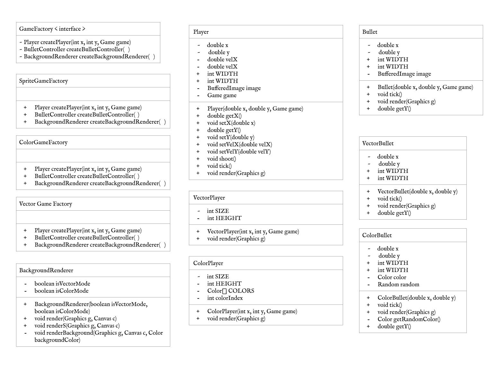
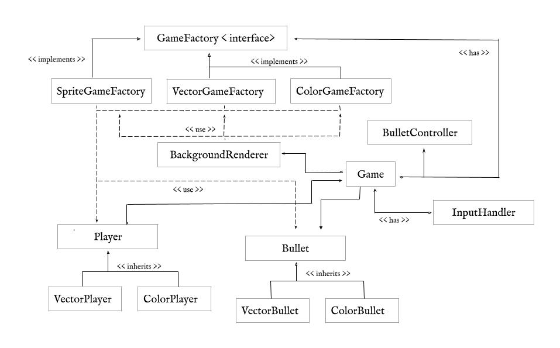

# Universidad de la Sabana
## Diseño y Arquitectura de Software
### Jorge Esteban Diaz Bernal, Laura Camila Rodriguez Leon, Juan Diego Martinez Escobar

#### Parte II. Refactoring de código ‘real’.

Para este ejercicio se hará refactoring a un juego publicado en [GitHUB](https://github.com/ekaputra07/spacewar-2d), y que fue modificado ligeramente para el propósito de este ejercicio. El juego actualmente funciona basado en Sprites, y el reto será aplicar el principio de Inversión de Dependencias, y los Patrones de Diseño Creacionales para lograr que:

1. La lógica del juego quede desacoplada del estilo de visualización de sus elementos.
2. La creación y el intercambio de nuevos estilos de visualización, se pueda hacer de manera transparente (sin tener que modificar el núcleo del juego).

En primera instancia, se quiere que la aplicación pueda ser fácilmente configurada para soportar dos diferentes estilos visuales: uno basado en sprites (imágenes) y el otro basado en gráficos vectoriales -retro- (primitivas gráficas como líneas, círculos, polígonos, etc.), tal como se muestra en la siguiente figura:

Para lograr esto, se sabe que es necesario desacoplar toda la lógica del juego del esquema de visualización del jugador (SpritePlayer), las balas (SpriteBullet) y el fondo del juego (BitmapBackgroundRenderer). Adicionalmente, se espera que para incorporar nuevos estilos visuales en el futuro, baste con cambiar un archivo de configuración (es decir, en el futuro no debe ser necesario modificar el código del juego).

### Actividades.

3.  Plantee en un diagrama de clases la solución aplicando el patrón fábrica abstracta.
	
   
5. Plantee un modelo de clases con la propuesta de cómo implementar el patrón.
   	

7. Basado en el modelo planteado, implemente el conjunto de productos concretos (y su fábrica concreta correspondiente), necesarios para soportar un jugador, balas y fondo de pantalla basados en vectores (para esto, revise en el API de Java, cómo con la clase Graphics se pueden hacer construcciones geométricas básicas como líneas, óvalos, etc).
Una vez hecho lo anterior, valide que se da el desacoplamiento: en ninguna parte del código original se deben mencionar las clases asociadas a algún esquema de visualización concreta (sprites/vectores).

8. Cree un nuevo estilo visual llamado ‘colorful-vectorial-style‘, similar al ‘vectorial-style‘, pero usando colores en lugar de sólo blanco y negro.

   --Nota: para cambiar entre estilos de juego se debe oprimir la tecla "F".
10. Valide que para incorporar y habilitar este nuevo estilo sólo haya sido necesario:

	* Crear nuevos productos concretos correspondientes a dicho esquema.
	* Crear su correspondiente fábrica concreta.
	* Cambiar la configuración de la fábrica abstracta.

 Este contenido hace parte del curso Procesos de Desarrollo de Software del programa de Ingeniería de Sistemas de la Escuela Colombiana de Ingeniería, y está licenciado como <a rel="license" href="http://creativecommons.org/licenses/by-nc/4.0/">Creative Commons Attribution-NonCommercial 4.0 International License</a>.

